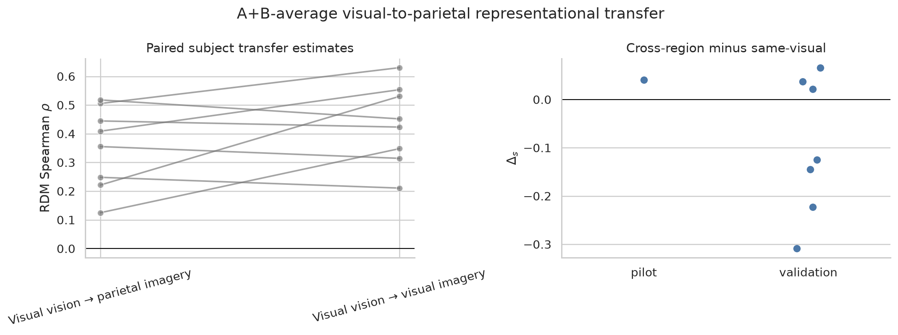

# What Survives in the Mind's Eye?

This project asks how much information transfers from visual perception to
mental imagery in the [NSD-Imagery dataset](https://openaccess.thecvf.com/content/CVPR2025/html/Kneeland_NSD-Imagery_A_Benchmark_Dataset_for_Extending_fMRI_Vision_Decoding_Methods_CVPR_2025_paper.html).
The main analyses compare representational geometry across tasks and cortical
regions, then test a frozen image-to-brain encoder trained on core NSD.

> **Current status:** the repository reflects the analyses used in the project
> presentation. Results are informative but still subject to revision. The
> strongest claims and their limitations are stated explicitly below.

## Results at a glance

### 1. Perception and imagery share target geometry

Across held-out subjects 02–08, simple shapes (Set A) show the clearest
vision–imagery RSA in early visual cortex (mean Spearman \(\rho=0.415\));
natural images (Set B) show positive transfer in the broader higher-visual ROI
(mean \(\rho=0.365\), 7/7 subjects positive). The direct higher-minus-early
regional contrast is not resolved, so these effects should not be described as
a confirmed region-by-stimulus interaction. In Notebook 03, the legacy
`higher_visual` mask combines ventral, lateral, and parietal stream labels;
Notebook 04 separates visual and dorsal-parietal cortex explicitly.


### 2. Cross-region geometry is present, but not stronger than same-region transfer

Using disjoint visual-stream and dorsal-parietal masks, visual-perception to
parietal-imagery RDM similarity is positive across all subjects
(\(\rho=0.353\), A+B average). It is numerically below same-visual transfer
(\(\rho=0.433\)); the cross-minus-same contrast is not significant. The
repeat-crossvalidated RDM result is near zero, so this analysis remains
exploratory.



### 3. A perception encoder transfers weak target ordering to imagery

A frozen DINOv2–PCA–ridge encoder predicts held-out core-NSD responses for
subject 01 (mean voxel correlation \(r=0.352\), mean \(R^2=0.144\)). Without
refitting, spatial brain correlation falls from \(r=0.244\) for NSD-Imagery
vision to \(r=0.132\) for imagery. Only 4.1% of imagery voxels have positive
target-wise predictive \(R^2\), so the current model carries weak target
ordering rather than calibrated imagery response amplitudes.


## Recommended notebook path

Notebooks `01–05` are the presentation-facing analysis. Start here unless you
are auditing a sensitivity analysis.

| Order | Notebook | Main question | Companion documentation |
|---|---|---|---|
| 01 | [Data orientation](notebooks/01_data_orientation.ipynb) | What files, events, targets, beta volumes, and ROI masks are in the dataset? | [Experiment recap](docs/guides/experiment_recap.md) |
| 02 | [Event alignment and first neural RDM](notebooks/02_event_alignment_neural_rdm.ipynb) | How do behavioral trials map to beta patterns, and how is a neural RDM constructed? | [RSA results](docs/results/rsa_results.md) |
| 03 | [Regional vision–imagery RSA](notebooks/03_regional_vision_imagery_rsa.ipynb) | Does target geometry transfer across subjects and early versus higher visual cortex? | [RSA results](docs/results/rsa_results.md) |
| 04 | [Cross-region RSA](notebooks/04_cross_region_rsa.ipynb) | Does visual-cortex perception geometry appear in parietal cortex during imagery? | [Cross-region RSA](docs/results/cross_region_rsa.md) |
| 05 | [Core-NSD brain encoder](notebooks/05_core_nsd_brain_encoder.ipynb) | Can a perception-trained image-to-brain model generalize to NSD-Imagery? | [Workflow](docs/guides/brain_encoding_workflow.md) · [Results](docs/results/brain_encoding_results.md) |

Notebooks `20–23` preserve useful checks and incomplete or less conclusive
branches without interrupting the main story:

| Notebook | Role |
|---|---|
| [20 — Measurement-first validation](notebooks/20_measurement_first_validation.ipynb) | Identification, cross-decoding, crossvalidated distances, and reliability checks |
| [21 — Full 18-target sensitivity](notebooks/21_full18_rdm_preprocessing_sensitivity.ipynb) | Exploratory A/B/C block structure under alternative preprocessing |
| [22 — Nonlinear and direct encoding](notebooks/22_nonlinear_and_direct_brain_encoder.ipynb) | Residual MLP and direct NSD-Imagery fits; currently secondary/negative |
| [23 — Paper-aligned brain correlation](notebooks/23_paper_brain_correlation.ipynb) | Beta-only diagnostic and exact reconstruction-scoring scaffold |

The notebook numbers changed to improve navigation. Existing `outputs/`
directory names retain their original analysis numbers for provenance and to
avoid breaking recorded command outputs.

## Get the data and run the notebooks

Clone the project and create its environment:

```bash
git clone https://github.com/mynanshan/NHprojectNSDimagery.git
cd NHprojectNSDimagery
conda env create -f environment.yml
conda activate nsdimagery
python -m ipykernel install --user \
  --name nsdimagery \
  --display-name "Python (NSD-Imagery)"
```

Estimate the minimal one-subject download before transferring anything:

```bash
bash scripts/download_nsdimagery_mvp.sh --subjects 01 --estimate
bash scripts/download_nsdimagery_mvp.sh --subjects 01 --dry-run
```

Download to persistent storage, then validate the layout:

```bash
bash scripts/download_nsdimagery_mvp.sh \
  --subjects 01 \
  --dest /your/persistent/storage/nsd

python scripts/check_nsdimagery_data.py /your/persistent/storage/nsd
```

The downloader retrieves prepared GLMsingle beta patterns, trial metadata,
design files, target images, and aligned ROI masks—not raw scanner data. Read
the [minimal download guide](docs/guides/data_download.md) before downloading
all eight subjects. The core-NSD encoder requires a separate, much larger
download described in the [brain-encoding workflow](docs/guides/brain_encoding_workflow.md).

## Dataset and paper references

- [NSD-Imagery CVPR 2025 paper page](https://openaccess.thecvf.com/content/CVPR2025/html/Kneeland_NSD-Imagery_A_Benchmark_Dataset_for_Extending_fMRI_Vision_Decoding_Methods_CVPR_2025_paper.html) — abstract, benchmark figures, paper PDF, and citation
- [NSD-Imagery paper PDF](https://openaccess.thecvf.com/content/CVPR2025/papers/Kneeland_NSD-Imagery_A_Benchmark_Dataset_for_Extending_fMRI_Vision_Decoding_Methods_CVPR_2025_paper.pdf) — experiment schematic and original reconstruction figures
- [NSD-Imagery supplementary material](https://openaccess.thecvf.com/content/CVPR2025/supplemental/Kneeland_NSD-Imagery_A_Benchmark_CVPR_2025_supplemental.pdf) — experiment and reconstruction details
- [Natural Scenes Dataset](https://naturalscenesdataset.org/) — parent dataset and access information
- [Original-paper methodology note](docs/guides/original_paper_methodology.md) — compact notation and a comparison with this repository's RSA analyses
- [Experiment recap](docs/guides/experiment_recap.md) — participant tasks, 12-run design, 18 targets, and 720-beta indexing

## Repository map

```text
notebooks/          presentation path (01–05) and secondary analyses (20–23)
docs/README.md      documentation index and notebook-to-document map
docs/guides/        data, experiment, and model workflow references
docs/results/       current scientific results and interpretation
docs/notes/         planning, evidence hierarchy, and reproduction notes
docs/figures/       stable report figures
scripts/            download, preparation, modeling, scoring, and plotting tools
nsdimagery/         reusable data-alignment and analysis utilities
outputs/            compact tracked results; large arrays are git-ignored
tests/              unit tests for reusable analysis code
```

For a document-by-document reading order, see the
[documentation index](docs/README.md).
