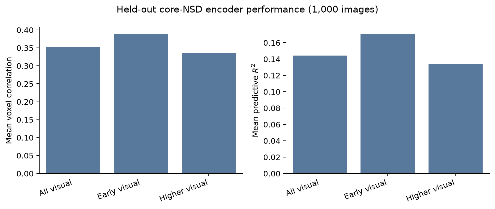
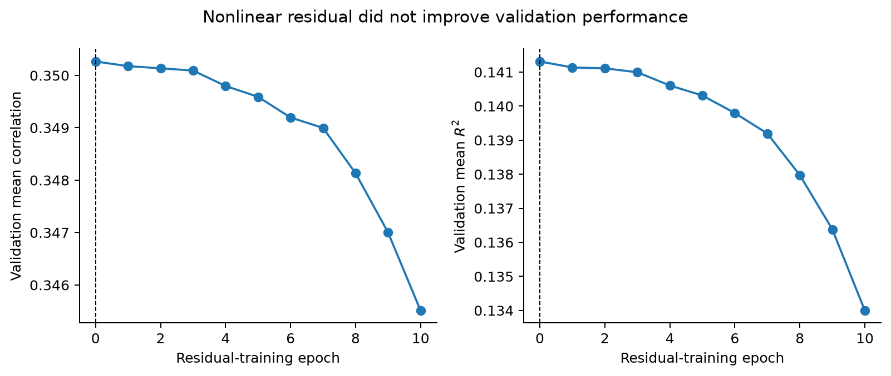
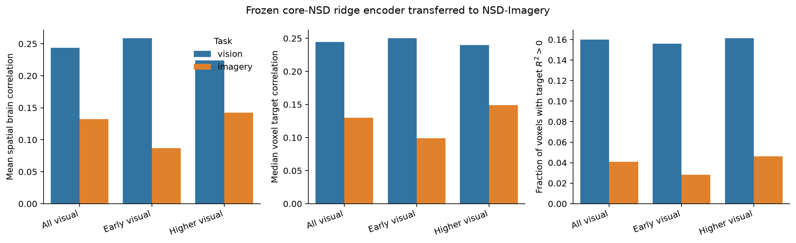
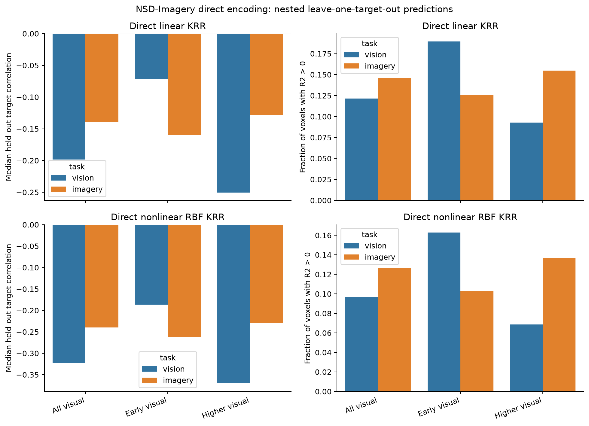

# Brain encoding results

This report summarizes the current brain encoding analyses for subject 01. The main result is mixed. The encoder predicts held-out core-NSD perception responses, but it does not predict NSD-Imagery response amplitudes well. The frozen encoder still carries a weak target-related signal. This signal is lower for imagery than for vision, especially in early visual cortex.

## 1. Data and questions

We ran three related analyses.

1. **Core-NSD encoding:** train an image-to-beta model on core NSD and test it on 1,000 held-out images.
2. **Frozen transfer:** keep the core-NSD model fixed and predict NSD-Imagery vision and imagery responses.
3. **Direct NSD-Imagery encoding:** fit new models within NSD-Imagery and test them on held-out target identities.

The first analysis tests ordinary visual encoding. The second asks what transfers across datasets and tasks. The third asks whether the same image features explain NSD-Imagery responses when fitted within that dataset.

## 2. Core-NSD model

### Image features

We use the pretrained `facebook/dinov2-small` model. We take hidden states from layers 3, 6, 9, and 12. For each layer, we retain the CLS token and pool patch tokens over 1-by-1 and 2-by-2 spatial grids. This gives a 9,216-dimensional feature vector:

$$
f(x) \in \mathbb{R}^{9216}.
$$

The features are standardized and reduced to 512 principal components:

$$
z(x) =
\operatorname{PCA}_{512}
\left(
\frac{f(x)-\mu_f}{\sigma_f}
\right).
$$

DINOv2 is nonlinear and pretrained. We do not train it on the fMRI data.

### Ridge readout

Let $Z$ contain image features and let $Y$ contain repeat-averaged beta responses. Each beta column is one voxel. The ridge model solves

$$
\widehat W_\lambda
=
\arg\min_W
\left\|Y-ZW\right\|_F^2
+\lambda\left\|W\right\|_F^2.
$$

The prediction for a new image is

$$
\widehat y(x)=z(x)^\top\widehat W_\lambda.
$$

We used 8,100 unique images for training, 900 for validation, and 1,000 shared images for the final test. The test images were not used to choose the PCA transform or ridge penalty. Validation selected $\lambda=1000$. The final model contains 15,724 visual-cortex voxels.

### Held-out core-NSD results

| Region | Voxels | Mean voxel correlation | Mean predictive $R^2$ |
|---|---:|---:|---:|
| All visual cortex | 15,724 | 0.352 | 0.144 |
| Early visual cortex | 4,657 | 0.388 | 0.170 |
| Higher visual cortex | 11,067 | 0.336 | 0.134 |

These are held-out results. The positive $R^2$ values show that the model predicts unseen core-NSD beta responses better than a test-set mean baseline. Performance is higher in early visual cortex than in higher visual cortex.

## 3. Nonlinear readout

We also tested a nonlinear residual readout:

$$
\widehat y_{\mathrm{NL}}(x)
=
\widehat y_{\mathrm{ridge}}(x)
+W_2\operatorname{GELU}(W_1\widetilde z(x)+b_1)+b_2.
$$

The hidden layer has 256 units and dropout of 0.1. The residual output layer starts at zero. Epoch 0 is therefore exactly the ridge model. Extra capacity is accepted only if it improves validation correlation.

Validation performance decreased after residual training began. The procedure selected epoch 0, so the nonlinear model was rejected. Its held-out test result is identical to ridge. This test does not show that every nonlinear readout will fail. It shows that this residual MLP did not add useful predictive signal under the current split and features.

## 4. Frozen transfer to NSD-Imagery

For this analysis, $\widehat W$ is trained only on core NSD and then fixed. No NSD-Imagery beta is used to update the model. We encode the 12 A+B target images and compare predicted responses with the mean NSD-Imagery response for each target.

We use three metrics.

- **Spatial brain correlation:** correlation across voxels for one target, then averaged across targets.
- **Voxel target correlation:** correlation across the 12 targets for one voxel.
- **Voxel target $R^2$:** calibration-sensitive prediction across the 12 targets:

$$
R_v^2
=
1-
\frac{\sum_t (y_{tv}-\widehat y_{tv})^2}
{\sum_t (y_{tv}-\overline y_v)^2}.
$$

$R^2$ can be negative on held-out or transferred data. A negative value means that the prediction has more squared error than predicting the voxel's mean response for every target. Correlation can still be positive because it does not require the prediction to have the correct scale or offset.

| Task | Region | Spatial brain correlation | Median voxel target correlation | Median voxel target $R^2$ | Voxels with $R^2>0$ |
|---|---|---:|---:|---:|---:|
| Vision | All visual | 0.244 | 0.245 | -0.735 | 16.0% |
| Vision | Early visual | 0.259 | 0.250 | -0.771 | 15.6% |
| Vision | Higher visual | 0.224 | 0.240 | -0.721 | 16.1% |
| Imagery | All visual | 0.132 | 0.130 | -2.003 | 4.1% |
| Imagery | Early visual | 0.087 | 0.099 | -3.018 | 2.8% |
| Imagery | Higher visual | 0.142 | 0.149 | -1.704 | 4.6% |

Two patterns are clear in this subject.

1. Vision correlations are higher than imagery correlations.
2. Within imagery, higher visual cortex transfers better than early visual cortex.

This is consistent with the idea that imagery preserves more high-level information than local visual detail. It is not a strong test of that claim. Most target $R^2$ values are negative, so the model does not predict NSD-Imagery response amplitudes well. The positive correlations indicate weak target ordering or tuning, not accurate beta prediction.

## 5. Direct fitting within NSD-Imagery

We also fitted models separately to NSD-Imagery vision and imagery betas. The feature extractor and the core-NSD PCA transform were fixed. The primary model was linear kernel ridge regression. An RBF kernel ridge model was a nonlinear sensitivity analysis:

$$
\widehat Y_*
=
K_{*T}(K_{TT}+\lambda I)^{-1}Y_T.
$$

The outer cross-validation leaves out one target identity at a time. Repeated trials from one target never appear in both training and test data. Hyperparameters are selected inside each training fold.

The median held-out target correlations were negative for both tasks and both kernels.

| Model | Task | All visual | Early visual | Higher visual |
|---|---|---:|---:|---:|
| Linear KRR | Vision | -0.199 | -0.071 | -0.250 |
| Linear KRR | Imagery | -0.140 | -0.160 | -0.129 |
| RBF KRR | Vision | -0.322 | -0.187 | -0.370 |
| RBF KRR | Imagery | -0.240 | -0.262 | -0.229 |

The median $R^2$ values were also negative. For the linear model, they were -0.597 for vision and -0.497 for imagery across visual cortex. The RBF model did not recover held-out target structure.

This direct analysis has only 12 independent target images. That is very small for fitting either a linear or nonlinear model. Split-half reliability is also low and unstable in many voxels. Direct fitting therefore does not provide clear evidence that these DINOv2 features explain NSD-Imagery target responses.

## 6. What we can and cannot conclude

### Supported by the current results

- The DINOv2-plus-ridge encoder predicts held-out core-NSD perception responses for subject 01.
- Core-NSD performance is stronger in early visual cortex than in higher visual cortex.
- Frozen transfer correlations are lower for imagery than for vision.
- The imagery transfer drop is larger in early visual cortex than in higher visual cortex.
- The tested residual MLP does not improve validation performance.
- Direct target-level fitting does not generalize to held-out NSD-Imagery targets.

### Still limited

- All results in this report come from one subject.
- NSD-Imagery has only 12 A+B target identities for this analysis.
- The displayed target image may not match the participant's mental image.
- Core NSD and NSD-Imagery differ in acquisition, task, and response scale.
- Positive correlation with negative $R^2$ is not accurate beta prediction.
- The nonlinear test covers one small residual architecture, not all nonlinear encoders.
- Voxel maps and region contrasts are exploratory until the same analysis is run across subjects.

## 7. Bottom line

The core perception encoder works on held-out core-NSD images. Its transfer to NSD-Imagery is weak and poorly calibrated. The relative transfer pattern is still interesting: imagery is weaker than vision, and imagery loses more signal in early visual cortex. This pattern fits the project hypothesis, but it should be treated as preliminary rather than as a confirmed group result.
