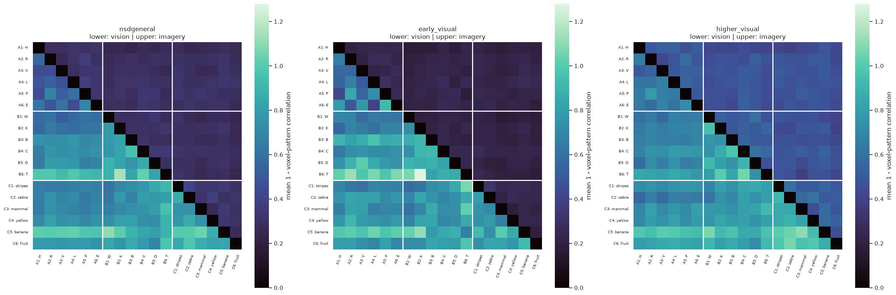
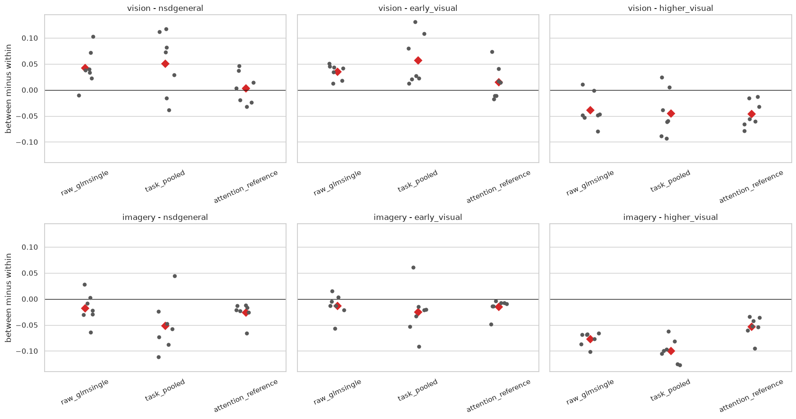
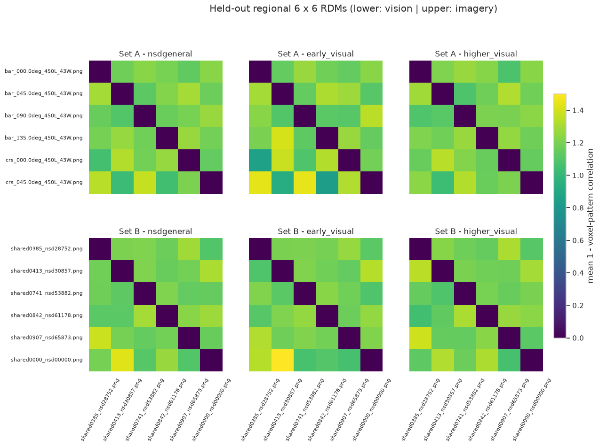
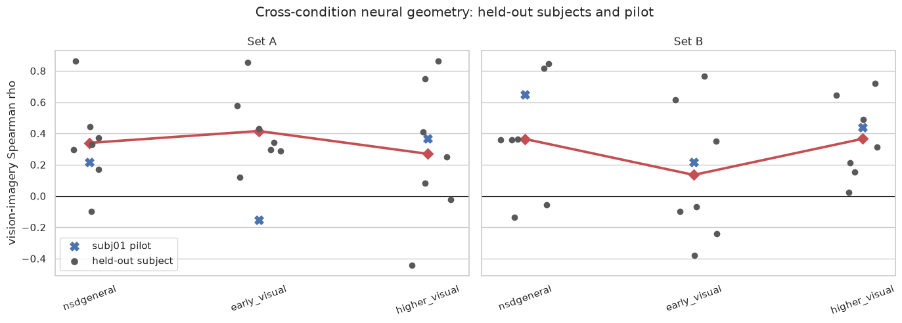
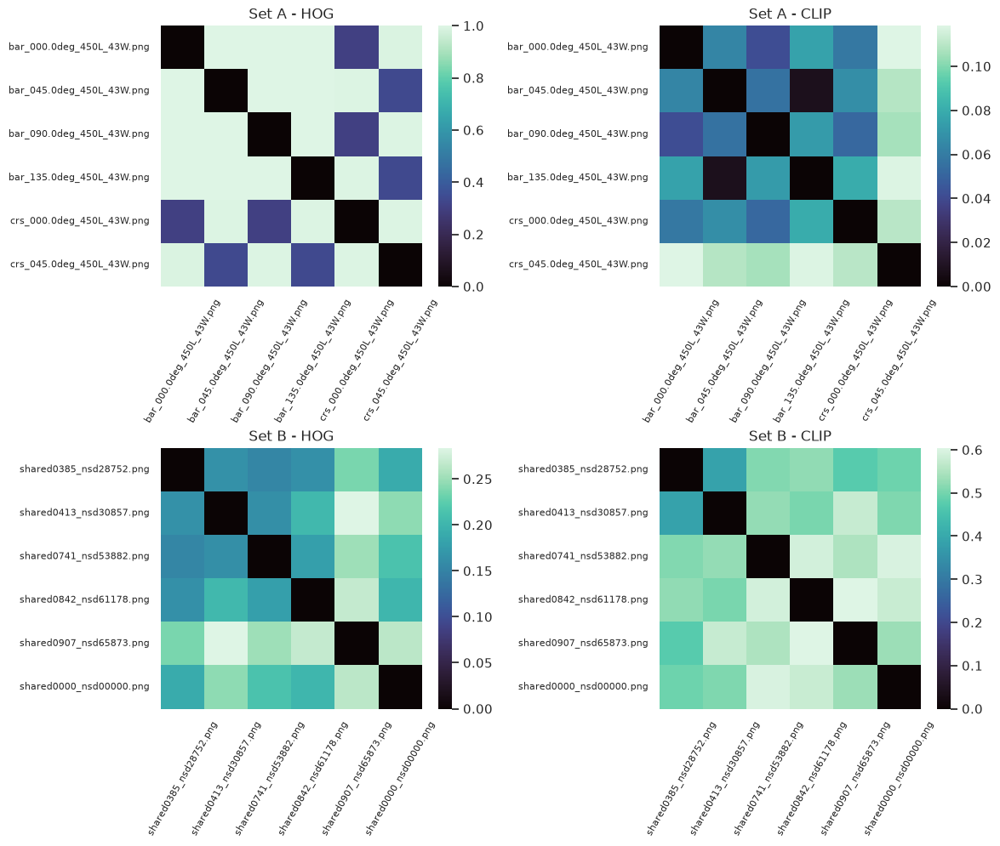
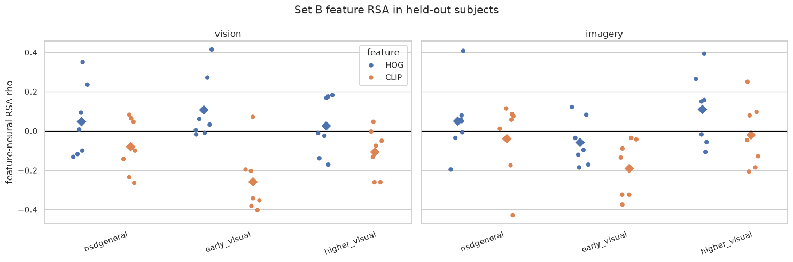
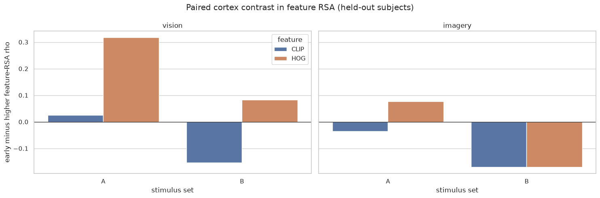

# RSA studies: methods, results, and current interpretation

This report summarizes the representational similarity analyses in:

- [Notebook 02](../notebooks/02_event_alignment_neural_rdm.ipynb), which
  validates trial-to-beta alignment and builds the first neural RDMs;
- [Notebook 02a](../notebooks/02a_full18_rdm_preprocessing_sensitivity.ipynb),
  which explores a joint 18-target RDM and several preprocessing choices;
- [Notebook 03](../notebooks/03_group_transfer_feature_rsa.ipynb), which
  repeats the neural analysis across participants and compares the neural RDMs
  with HOG and CLIP feature RDMs.

The main result is encouraging: for the six natural images in Set B, vision and
imagery have consistently aligned representational geometry in higher visual
cortex across the seven held-out participants. Simple shapes in Set A show a
complementary pattern, with the clearest transfer in early visual cortex.
However, the direct higher-versus-early regional contrast is not statistically
decisive, and the pretrained feature models do not identify the transferred
Set B information as semantic.

## 1. Questions

The RSA work asks three related questions:

1. **Neural transfer:** Are targets that evoke similar brain-response patterns
   during vision also similar during imagery?
2. **Cortical differences:** Does this vision-imagery correspondence differ
   between early and higher visual cortex?
3. **Feature explanation:** Is the neural geometry better explained by
   low-level image structure, represented by HOG, or by a pretrained
   visual-semantic representation, represented by CLIP?

The three stimulus sets are:

| Set | Targets | Role in the analysis |
|---|---|---|
| A | Six oriented bars and crosses | Controlled simple visual structure |
| B | Six fixed natural images | Complex objects and scenes |
| C | Six learned concepts | Exploratory only; vision uses varying exemplars |

Set C is useful for exploration, but it is not included in the main feature
RSA because each concept does not correspond to one fixed image.

## 2. How the neural RDMs are constructed

For each participant, region, task, and target, we first standardize each
voxel's beta responses within run and then average the target's repeated
trials. Let

$$
\bar{\mathbf{x}}_{s,r,t,k}
$$

denote the resulting voxel-response pattern for participant \(s\), region
\(r\), task \(t\), and target \(k\). The neural dissimilarity between targets
\(i\) and \(j\) is

$$
D_{s,r,t}(i,j)
=
1-\operatorname{cor}
\left(
\bar{\mathbf{x}}_{s,r,t,i},
\bar{\mathbf{x}}_{s,r,t,j}
\right).
$$

Each six-target RDM therefore has 15 unique off-diagonal distances. A small
distance means that two targets produce similar multivoxel patterns; a large
distance means that the patterns differ.

Vision-imagery alignment is measured with a Spearman correlation between the
15 vision and imagery distances:

$$
\rho_{s,r}
=
\operatorname{cor}_{\mathrm{Spearman}}
\left[
\operatorname{vec}_{\triangle}(D_{s,r,\mathrm{vision}}),
\operatorname{vec}_{\triangle}(D_{s,r,\mathrm{imagery}})
\right].
$$

A positive value means that target pairs that are relatively similar during
vision also tend to be relatively similar during imagery. It does not, by
itself, tell us which visual or semantic property creates that organization.

The regional analysis uses 1,200 sampled voxels per participant and ROI:

| Analysis ROI | Mask used in Notebook 03 |
|---|---|
| `nsdgeneral` | Broad visual-cortex mask |
| `early_visual` | V1-V3 dorsal and ventral labels |
| `higher_visual` | Ventral, lateral, and parietal stream labels |

Participant 01 was used while developing the pipeline and is shown as the
pilot. Group tests use participants 02-08. Exact sign-flip tests treat
participants, rather than the 15 correlated RDM entries, as the uncertainty
unit.

## 3. Exploratory 18-target RDM

Notebook 02a concatenates Sets A, B, and C into one 18-target RDM. This gives a
compact overview of within-set and between-set distances. The lower triangle
of each panel is vision and the upper triangle is imagery.

*Figure 1. Group 18-target neural RDMs. White lines separate Sets A, B, and C.
The lower triangle shows vision and the upper triangle shows imagery.*

The plot contains visible set-level structure, especially for vision, but it
does not provide clean evidence that the three experimental sets form neural
categories. Absolute dissimilarities differ strongly between vision and
imagery, and the apparent block structure changes with region and
preprocessing.

The following plot summarizes this using

$$
\Delta_{\mathrm{block}}
=
\text{mean between-set distance}
-
\text{mean within-set distance}.
$$

Positive values indicate category-like blocks: targets from the same set are,
on average, closer than targets from different sets.

*Figure 2. Between-set minus within-set distance for each participant, task,
ROI, and preprocessing route. Gray points are participants and red diamonds
are group means.*

For vision, \(\Delta_{\mathrm{block}}\) is modestly positive in
`nsdgeneral` and early visual cortex but negative in higher visual cortex.
For imagery it is generally negative. The sign and size also depend on the
preprocessing route.

The 18-target vision-imagery RDM correlations are modest and are much stronger
within sets than between sets. Under the task-pooled preprocessing route:

| ROI | Full 18-target rho | Within-set rho | Between-set rho |
|---|---:|---:|---:|
| `nsdgeneral` | 0.101 | 0.239 | 0.057 |
| Early visual | 0.104 | 0.224 | 0.046 |
| Higher visual | 0.158 | 0.255 | 0.039 |

This is why the separate 6-by-6 analyses are the clearer primary analysis:
they compare vision and imagery within a common stimulus domain without
asking the between-set distances to carry the result.

## 4. Regional six-target neural RSA

Notebook 03 averages the held-out participants' RDMs for visualization. Each
panel combines two ordinary six-target RDMs: vision is below the diagonal and
imagery is above it.

*Figure 3. Held-out group RDMs for Sets A and B. Lower triangles show vision;
upper triangles show imagery.*

The quantitative result is the within-participant vision-imagery RDM
correlation:

| Set | ROI | Mean rho | Median rho | One-sided exact p | Two-sided exact p |
|---|---|---:|---:|---:|---:|
| A | Early visual | **0.415** | 0.343 | **0.0078** | **0.0156** |
| A | Higher visual | 0.269 | 0.250 | 0.0938 | 0.1875 |
| A | `nsdgeneral` | 0.339 | 0.329 | 0.0156 | 0.0313 |
| B | Early visual | 0.135 | -0.068 | 0.2344 | 0.4688 |
| B | Higher visual | **0.365** | 0.314 | **0.0078** | **0.0156** |
| B | `nsdgeneral` | 0.364 | 0.361 | 0.0313 | 0.0625 |

*Figure 4. Vision-imagery RDM correlations. Black points are held-out
participants, red diamonds and lines are held-out means, and blue crosses show
the participant-01 pilot.*

### 4.1 Natural images: consistent transfer in higher visual cortex

For Set B, the higher-visual vision-imagery correlation is positive in all
seven held-out participants. This gives the smallest possible one-sided exact
p-value with seven participants:

$$
p=\frac{1}{2^7}=0.0078125.
$$

Set B's early-visual coefficients are much less consistent: the mean is
positive, but the median is slightly negative. This supports the plain
statement:

> Natural-image representations show consistent vision-imagery alignment in
> higher visual cortex, whereas their alignment in early visual cortex is
> weak and heterogeneous.

### 4.2 Simple shapes: stronger early-visual transfer

Set A shows the complementary tendency. Its early-visual coefficient is
positive in all seven held-out participants and has the largest group mean in
the table. This is plausible because the targets are distinguished mainly by
orientation and spatial layout, properties strongly represented in early
visual cortex.

This result argues against saying that imagery preserves *only* semantic
content. For simple, highly controlled stimuli, some low-level or
shape-related organization also transfers between vision and imagery.

### 4.3 The anatomical contrast remains suggestive

The regional ordering is scientifically interesting, but the direct paired
contrasts are not statistically decisive:

| Set | Mean higher-minus-early rho | Two-sided exact p |
|---|---:|---:|
| A | -0.146 | 0.516 |
| B | 0.231 | 0.328 |

For Set B, higher visual cortex exceeds early visual cortex in five of seven
held-out participants, but the other two participants show substantial
effects in the opposite direction. The exploratory stimulus-by-region
difference of differences is positive,

$$
\left(B_{\mathrm{higher}}-B_{\mathrm{early}}\right)
-
\left(A_{\mathrm{higher}}-A_{\mathrm{early}}\right)
=0.377,
$$

but is not statistically resolved with seven participants
(\(p_{\mathrm{two-sided}}=0.281\)).

The best-supported result is therefore **positive Set B transfer in higher
visual cortex**, not a proven higher-greater-than-early anatomical
interaction.

### 4.4 Early and higher cortex share some geometry

Second-order RSA directly comparing the early- and higher-visual RDMs is
moderately positive:

| Set | Task | Mean early-versus-higher RDM rho |
|---|---|---:|
| A | Vision | 0.396 |
| A | Imagery | 0.468 |
| B | Vision | 0.447 |
| B | Imagery | 0.363 |

Thus, the two regions do not contain completely unrelated target
organizations. The result is a difference in how consistently the
organization transfers across tasks, not a clean separation into one
"visual" region and one "semantic" region.

`nsdgeneral` overlaps with the more specific visual ROIs and should not be
treated as an independent anatomical sample. Its Set B transfer is almost
identical to the higher-visual result, showing that the signal is visible in
the broad mask but not localizing it more precisely.

## 5. RSA with pretrained image features

Notebook 03 constructs two candidate feature RDMs:

- **HOG**, a hand-designed descriptor of local edges, orientation, and coarse
  spatial layout;
- **CLIP**, using the projected image embedding from
  `openai/clip-vit-base-patch32`, intended as a higher-level
  visual-semantic representation.

Feature RDMs use cosine distance, and feature-neural RSA correlates their 15
distances with the corresponding neural RDM distances.

*Figure 5. HOG and CLIP feature RDMs for the fixed images in Sets A and B.*

### 5.1 A useful positive control

For Set A vision, early-visual neural geometry aligns with HOG:

| ROI | Mean HOG-neural rho | Two-sided exact p |
|---|---:|---:|
| Early visual | **0.365** | **0.0156** |
| `nsdgeneral` | 0.245 | 0.0156 |
| Higher visual | 0.048 | 0.5625 |

This is the expected direction for oriented bars and crosses. It shows that
the feature-RSA pipeline can recover a clear low-level relationship when the
stimulus set and feature model are well matched. The corresponding Set A
imagery feature associations are weak.

### 5.2 Set B does not receive a clear feature explanation

The natural-image results are mixed:

| Task | ROI | HOG mean rho | CLIP mean rho |
|---|---|---:|---:|
| Vision | Early visual | 0.108 | -0.259 |
| Vision | Higher visual | 0.026 | -0.105 |
| Imagery | Early visual | -0.058 | -0.190 |
| Imagery | Higher visual | 0.112 | -0.020 |

*Figure 6. Set B feature-neural RSA in held-out participants. Diamonds show
group means.*

The planned Set B higher-visual imagery contrast is

$$
\rho_{\mathrm{CLIP}}-\rho_{\mathrm{HOG}}
=-0.132,
\qquad
p_{\mathrm{two-sided}}=0.0313.
$$

This is opposite to the predicted CLIP advantage. The broader regional
contrast plot is also irregular:

*Figure 7. Mean early-minus-higher feature RSA for Sets A and B. These are
exploratory paired contrasts across the seven held-out participants.*

We therefore consider this pretrained-feature experiment inconclusive rather
than evidence against semantic imagery. With only six targets, each RSA uses
15 distances. A single CLIP output layer may also be poorly matched to the
particular distinctions among these images. The negative or near-zero CLIP
coefficients mean that this chosen CLIP RDM does not explain the neural
geometry; they do not mean that the brain represents "anti-semantic"
information.

The result of this experiment is:

> Natural-image neural geometry transfers between vision and imagery in
> higher visual cortex, but HOG and the selected CLIP embedding do not clearly
> explain what information is transferring.

Possible future feature analyses should be treated as new exploratory work.
They could include intermediate CLIP layers, self-supervised visual features
such as DINO, caption or target-name embeddings, and a behavioral similarity
RDM. Increasing the number of targets would be more valuable than adding many
models to the current 15-distance comparison.

## 6. What the current evidence supports

### Supported

1. For Set B natural images, higher-visual vision-imagery RDM correlations are
   positive in all seven held-out participants.
2. For Set A simple shapes, early-visual vision-imagery correlations are
   positive in all seven held-out participants.
3. Set A vision provides a coherent positive control: HOG aligns most clearly
   with early-visual neural geometry.
4. Early and higher visual cortex share some target geometry rather than
   forming completely separate representational systems.

### Suggestive but not established

1. Natural-image alignment may be greater in higher than early visual cortex.
2. Simple-shape alignment may be greater in early than higher visual cortex.
3. Together these form a plausible stimulus-type-by-region crossover, but
   the paired interaction is not statistically resolved.

### Not supported

1. The 18-target RDM does not establish three clean neural categories.
2. The current analysis does not show that imagery preserves only semantic
   information.
3. CLIP does not explain the transferred Set B higher-visual geometry.
4. `nsdgeneral` cannot be interpreted as an anatomical region independent of
   the early- and higher-visual masks.

## 7. Compact note on reliability

We computed odd-even splits, repeated balanced splits, imagery run-to-run
correlations, and crossvalidated distances as measurement diagnostics. They
are not used as the main evidence in this report. The original six-target RDM
already contains only 15 distances, and dividing the available trials creates
even noisier half-sample RDMs. The resulting reliability estimates vary
substantially and should not be used to exclude participants or select
favorable conditions.

At the same time, weak within-condition estimates limit how precisely any
individual RDM can be interpreted. The most useful protection here is the
participant-level replication: Set B higher-visual transfer and Set A
early-visual transfer are positive in all seven held-out participants.
Reliability results should remain a compact supplementary diagnostic rather
than the headline of the RSA analysis.

## 8. Limitations

1. **Six targets per set:** each RSA is based on only 15 pairwise distances.
2. **Seven held-out participants:** exact group p-values are coarse; the
   smallest possible one-sided value is \(1/128\).
3. **Many exploratory comparisons:** only the pre-specified Set B
   higher-visual transfer test should receive confirmatory emphasis.
4. **Feature-model mismatch:** one HOG specification and one final CLIP
   embedding cannot span all plausible low- and high-level representations.
5. **ROI overlap and definition:** the three masks are not three independent
   samples of cortex.
6. **Set C exemplars:** its vision trials use varying rendered images, so its
   full-RDM entries do not have the same fixed-stimulus interpretation as Sets
   A and B.
7. **Cue and task structure:** shared cue or task-related activity could
   contribute to vision-imagery correspondence.
8. **Voxel subsampling:** each ROI uses a deterministic 1,200-voxel sample;
   broader stability checks would be useful.

## 9. Current conclusion

The RSA analyses provide a meaningful base result. Natural-image
representational geometry is consistently shared between perception and
imagery in higher visual cortex, while simple-shape geometry transfers most
clearly in early visual cortex. This pattern is compatible with imagery
preserving more abstract information for complex natural stimuli, but it does
not yet prove a semantic mechanism or a statistically clear anatomical
interaction. The pretrained-feature analysis remains unresolved, so the
content carried by the transferable Set B geometry is still an open question.
